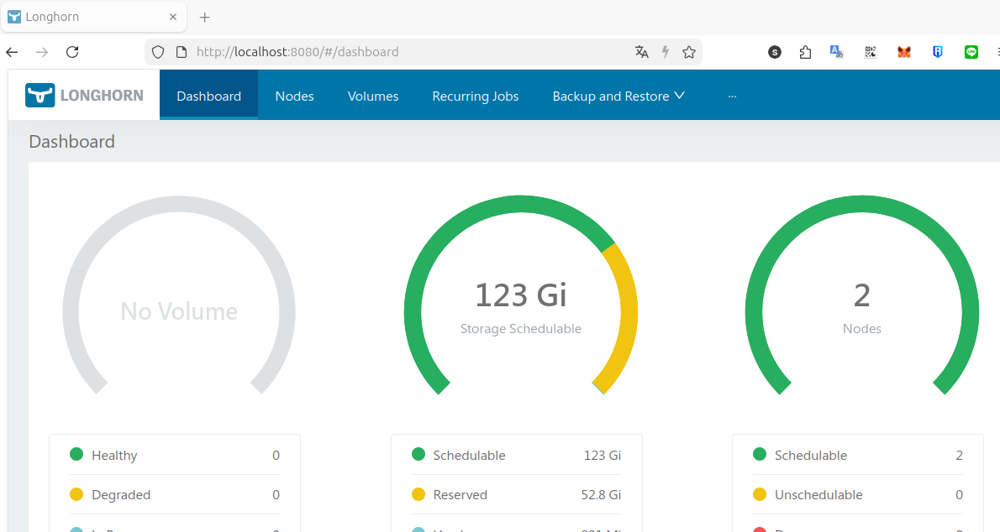

# 09 永続ストレージlonghornの構築

## 1. ノードへのゾーンラベル付与
各ノードがどのゾーンに属するかをLonghornに認識させるため、ノードにラベルを付けます。

### ラベルの作成
ホスト機ごとにk3sノードのラベル分けをする
```bash
kubectl label node ha-worker1 topology.kubernetes.io/zone=zone-a --overwrite
kubectl label node hb-worker1 topology.kubernetes.io/zone=zone-b --overwrite
```
Podのデプロイ先制御
```bash
kubectl label node ha-worker1 longhorn=true
node/ha-worker1 labeled
kubectl label node hb-worker1 longhorn=true
node/hb-worker1 labeled


```

間違えた他のノードにやった場合
```
kubectl label node 対象ノード topology.kubernetes.io/zone-
```

### 確認
```bash
kubectl get nodes --show-labels | grep topology.kubernetes.io/zone
ha-worker1   Ready    <none>          15d   v1.34.3+k3s1   beta.kubernetes.io/arch=amd64,beta.kubernetes.io/instance-type=k3s,beta.kubernetes.io/os=linux,datacenter=ha,kubernetes.io/arch=amd64,kubernetes.io/hostname=ha-worker1,kubernetes.io/os=linux,node.kubernetes.io/instance-type=k3s,topology.kubernetes.io/zone=zone-a
hb-worker1   Ready    <none>          15d   v1.34.3+k3s1   beta.kubernetes.io/arch=amd64,beta.kubernetes.io/instance-type=k3s,beta.kubernetes.io/os=linux,datacenter=hb,kubernetes.io/arch=amd64,kubernetes.io/hostname=hb-worker1,kubernetes.io/os=linux,node.kubernetes.io/instance-type=k3s,topology.kubernetes.io/zone=zone-b
```

## 2. Longhornのインストール
Helm を使用してLonghornをインストールします。まずLonghorn Helmリポジトリを追加し、アップデートします。

### install helm
https://helm.sh/ja/docs/intro/install/

```bash
curl -fsSL -o get_helm.sh https://raw.githubusercontent.com/helm/helm/main/scripts/get-helm-4
chmod 700 get_helm.sh
./get_helm.sh
```

### install longhorn
#### マウントディレクトリの準備
ホスト機で実行
```bash
# worker1にssh
for x in ha-worker1 hb-worker1; do
    ssh -o BatchMode=yes k3sadmin@$x
done
```
##### 各ノード内で作業
```text
# shared準備
sudo tee /etc/init.d/root-shared << 'EOF'
#!/sbin/openrc-run

description="Make root filesystem shared"

depend() {
    # rootが利用可能になった直後、localmountより前に実行
    need root
    before localmount
}

start() {
    ebegin "Making root filesystem shared"
    mount --make-shared /
    eend $?
}

stop() {
    # 停止時は何もしない
    return 0
}
EOF

sudo chmod +x /etc/init.d/root-shared
sudo rc-update add root-shared boot
```
```text
# 共有ストレージの作成
sudo fdisk /dev/vda
  n
  p
  enter (pertition number)
  enter (size)
  p (確認)
  w (書き込み)
sudo mkfs.ext4 /dev/vda4
sudo mkdir /var/lib/longhorn
echo '/dev/vda4 /var/lib/longhorn ext4 defaults 0 0' | sudo tee -a /etc/fstab
sudo mount /dev/vda4 /var/lib/longhorn

# longhorn利用可能に共有・bind設定(fstabに書くと/var/lib/longhornが既に/dev/vda4でmountするので無視されるためコマンドで対応する)
sudo vi /etc/local.d/longhorn-mount.start
```
```text
#!/bin/sh
# Longhorn bind mount script for Alpine Linux

mount -a
sleep 3

mount --bind /var/lib/longhorn /var/lib/longhorn
mount --make-shared /var/lib/longhorn

echo "$(date): Longhorn bind mount completed" >> /var/log/longhorn-mount.log
```
```text
sudo chmod +x /etc/local.d/longhorn-mount.start
sudo rc-update add local
sudo rc-service local start

# 確認
hb-worker1:~$ rc-update show | grep root-shared
          root-shared | boot                                   

sudo apk add findmnt


ha-worker1:~$ findmnt -o TARGET,PROPAGATION /var/lib/longhorn
TARGET            PROPAGATION
/var/lib/longhorn shared
/var/lib/longhorn shared

ha-worker1:~$ cat /proc/self/mountinfo | grep longhorn
294 40 0:103 / /var/lib/kubelet/pods/4b7fc81f-8691-45d2-be24-a61e081942fc/volumes/kubernetes.io~secret/longhorn-grpc-tls rw,relatime shared:6 - tmpfs tmpfs rw,size=4020756k,inode64,noswap
480 27 253:4 / /var/lib/longhorn rw,relatime shared:43 - ext4 /dev/vda4 rw
366 480 253:4 / /var/lib/longhorn rw,relatime shared:43 - ext4 /dev/vda4 rw
404 40 0:144 / /var/lib/kubelet/pods/00d929ce-c580-417e-9533-c3c0ff2b98a9/volumes/kubernetes.io~secret/longhorn-grpc-tls rw,relatime shared:31 - tmpfs tmpfs rw,size=4020756k,inode64,noswap

# iscsiのインストール
sudo apk update
sudo apk add open-iscsi nfs-utils
sudo rc-update add iscsid
sudo rc-service iscsid start
```


#### Longhorn Helmリポジトリを追加し、アップデート
```bash
helm repo add longhorn https://charts.longhorn.io
```
```bash
helm repo update
```
#### マルチゾーン対応のために defaultSettings を指定してインストール
- デフォルトのレプリカ数を2に設定し、レプリカのスケジューリングでゾーンを考慮するようにします。
- defaultSettings.replicaZoneSoftAntiAffinity=false とすることで、レプリカが可能な限り異なるゾーンに配置されるようになります（ハードアンチアフィニティに近い動作）
```bash
# values.yamlファイルを作成
cat > longhorn-values.yaml << 'EOF'
defaultSettings:
  defaultReplicaCount: 2
  replicaZoneSoftAntiAffinity: false
longhornManager:
  nodeSelector:
    longhorn: "true"
longhornDriver:
  nodeSelector:
    longhorn: "true"
csi:
  attacher:
    nodeSelector:
      longhorn: "true"
  provisioner:
    nodeSelector:
      longhorn: "true"
EOF

 
helm install longhorn longhorn/longhorn \
  --namespace longhorn-system \
  --create-namespace \
  -f longhorn-values.yaml \
  --wait
```

#### 接続テスト
kubectl利用しているクライアント端末のみ接続可能
```bash
kubectl port-forward -n longhorn-system service/longhorn-frontend 8080:80
```

http://localhost:8080/#/dashboard


##### 以下は作り直す場合のメモ
```bash
kubectl delete namespace longhorn-system --force --grace-period=0

for crd in backuptargets.longhorn.io engineimages.longhorn.io nodes.longhorn.io; do
    echo "Processing $crd"
    kubectl patch crd $crd -p '{"metadata":{"finalizers":[]}}' --type=merge
done

for crd in $(kubectl get crd | grep longhorn | awk '{print $1}'); do     echo "Deleting $crd";     timeout 3 kubectl delete crd $crd; done

# pod以外削除
for tgt in $( kubectl get all -A|grep -i longhorn|grep -v pod\/ | awk '{print $2}') ; do timeout 1 kubectl delete -n longhorn-system $tgt ; done

# pod削除
kubectl delete pod -n longhorn-system --all --force --grace-period=0

# helm削除
kubectl delete secret -n longhorn-system -l owner=helm,name=longhorn --ignore-not-found=true
helm uninstall longhorn -n longhorn-system --no-hooks --ignore-not-found
```

```bash
# すべてのLonghorn関連リソースが消えたことを確認
kubectl get crd | grep longhorn || echo "No Longhorn CRDs remaining"
kubectl get namespace longhorn-system 2>/dev/null || echo "Namespace not found"
kubectl get all -A|grep -i longhorn
```
