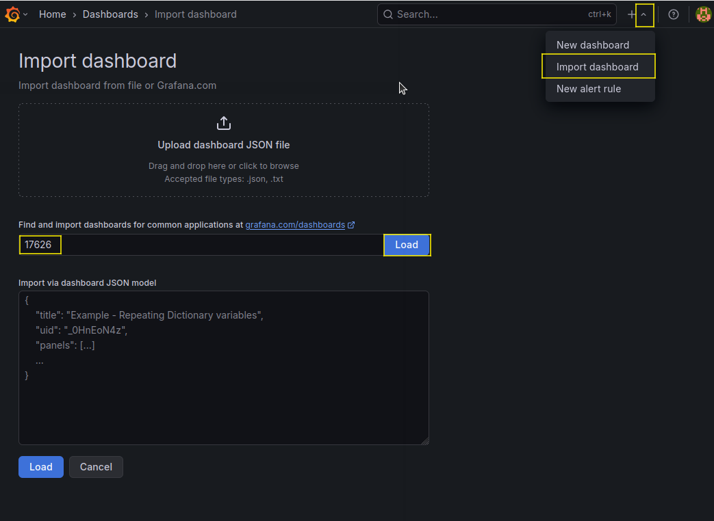
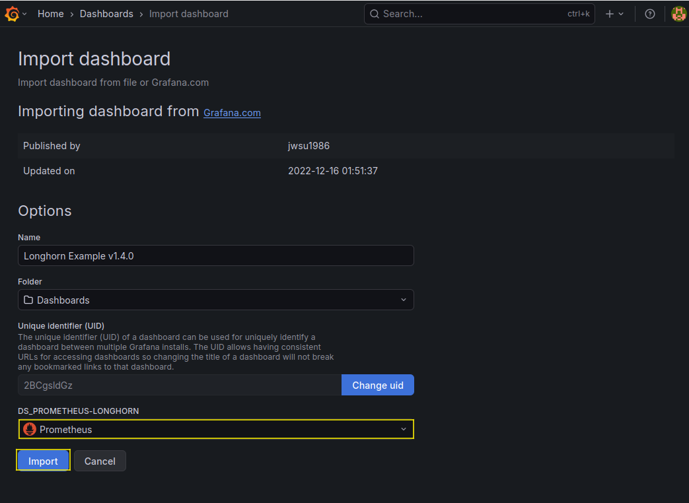
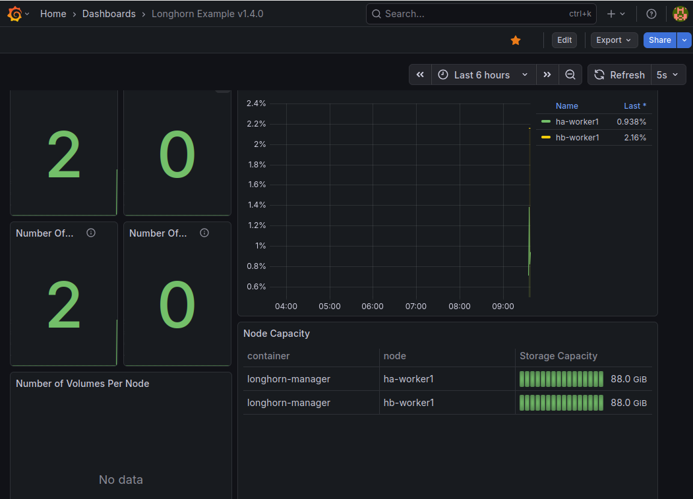

# 10 prometheus / grafana

## アプリケーションと永続ストレージ構成

|コンポーネント|	役割|	推奨ストレージサイズ|	永続化の目的|
|--------------|------|---------------------|-------------|
|Prometheus|	メトリクスデータの収集・保存サーバー|	5〜10GB| 	長期間のデータを保存し、過去の傾向分析や障害時の原因調査を可能にするため。|
|Alertmanager|	アラートの管理・通知|	1GB| 	アラート設定や通知の履歴を保持し、Pod再起動時の設定消失を防ぐため。|
|Grafana|	データ可視化ダッシュボード|	1〜2GB|	作成したダッシュボードやデータソース設定を保持し、カスタム設定を永続化するため。|

## Longhornを利用したPrometheus/Grafanaの永続化
### 1. Helmリポジトリの追加
Prometheus Communityが提供するHelmチャートのリポジトリを追加
```bash
helm repo add prometheus-community https://prometheus-community.github.io/helm-charts
helm repo update
```

### 2. 設定ファイルの作成
インストール時のカスタム設定を記述するためのファイルを作成します。ここで、Longhornをストレージクラスとして指定し、各コンポーネントに永続ボリュームを要求する設定を追加します

```bash
vi longhorn-monitoring-values.yaml
```
```yaml
global:
  nodeSelector:
    longhorn: "true"

alertmanager:
  alertmanagerSpec:
    storage:
      volumeClaimTemplate:
        spec:
          storageClassName: longhorn
          accessModes: ["ReadWriteOnce"]
          resources:
            requests:
              storage: 1Gi
  nodeSelector:
    longhorn: "true"

prometheus:
  prometheusSpec:
    storageSpec:
      volumeClaimTemplate:
        spec:
          storageClassName: longhorn
          accessModes: ["ReadWriteOnce"]
          resources:
            requests:
              storage: 10Gi
  nodeSelector:
    longhorn: "true"

grafana:
  persistence:
    enabled: true
    storageClassName: longhorn
    accessModes: ["ReadWriteOnce"]
    size: 2Gi
  adminPassword: "prom-operator"
  nodeSelector:
    longhorn: "true"

prometheus-node-exporter:
  nodeSelector:
    longhorn: "true"

kube-state-metrics:
  nodeSelector:
    longhorn: "true"

prometheusOperator:
  nodeSelector:
    longhorn: "true"
```

- storageClassName: longhorn
  - 先ほど構築したLonghornを使用するように指定
- volumeClaimTemplate: 
  - PromeeusとAlertmanagerに対して、永続ボリュームの要求テンプレートを定義
- grafana.persistence: 
  - Grafana永続化
- nodeSelector:     longhorn: "true"
  - ha-worker1,hb-worker1のみにリソースを作成する（longhornを構築したノードのみに作られるようにラベルを指定）

### 3. 監視スタックのインストール
#### BackupTargetを作成
今回は空で作成

S3やNFS,sambaなど指定できるようです。

https://www.bookstack.cn/read/longhorn-1.9.0-en/f00b009481f25078.md

```bash
cat << EOF | kubectl apply -f -
apiVersion: longhorn.io/v1beta2
kind: BackupTarget
metadata:
  name: default
  namespace: longhorn-system
spec:
  backupTargetURL: ""
  credentialSecret: ""
  pollInterval: "5m0s"
EOF
```

```bash
kubectl -n longhorn-system get backuptarget
```

#### kube-prometheus-stack をインストール
```bash
kubectl create namespace monitoring

helm install prometheus-stack prometheus-community/kube-prometheus-stack   --namespace monitoring   -f longhorn-monitoring-values.yaml --wait
```

get information
```bash
kubectl --namespace monitoring get secrets prometheus-stack-grafana -o jsonpath="{.data.admin-password}" | base64 -d ; echo

export POD_NAME=$(kubectl --namespace monitoring get pod -l "app.kubernetes.io/name=grafana,app.kubernetes.io/instance=prometheus-stack" -oname)
kubectl --namespace monitoring port-forward $POD_NAME 3000

# Get your grafana admin user password by running:
kubectl get secret --namespace monitoring -l app.kubernetes.io/component=admin-secret -o jsonpath="{.items[0].data.admin-password}" | base64 --decode ; echo
```

### 4. デプロイ状態の確認
すべてのPodが正常に起動しているか確認
```bash
kubectl -n monitoring get pod -o wide
```
> NAME                                                     READY   STATUS    RESTARTS   AGE    IP             NODE         NOMINATED NODE   READINESS GATES
> alertmanager-prometheus-stack-kube-prom-alertmanager-0   2/2     Running   0          104s   10.42.1.52     ha-worker1   <none>           <none>
> 
> prometheus-prometheus-stack-kube-prom-prometheus-0       1/2     Running   0          104s   10.42.1.53     ha-worker1   <none>           <none>
> 
> prometheus-stack-grafana-57f9bbbc4-4qmss                 3/3     Running   0          117s   10.42.16.128   hb-worker1   <none>           <none>
> 
> prometheus-stack-kube-prom-operator-5b48df5679-glzc2     1/1     Running   0          117s   10.42.16.127   hb-worker1   <none>           <none>
> 
> prometheus-stack-kube-state-metrics-668495c8c6-dwhb5     1/1     Running   0          117s   10.42.1.51     ha-worker1   <none>           <none>
> 
> prometheus-stack-prometheus-node-exporter-8qcgq          1/1     Running   0          117s   172.31.1.22    hb-worker1   <none>           <none>
> 
> prometheus-stack-prometheus-node-exporter-v2n46          1/1     Running   0          117s   172.31.1.12    ha-worker1   <none>           <none>
ha-worker1,hb-worker2のみに作られていることを確認

### 5. 永続ボリュームの確認
Longhornが期待通りにボリュームをプロビジョニングしているか確認

```bash
kubectl -n monitoring get pv
```
> NAME                                       CAPACITY   ACCESS MODES   RECLAIM POLICY   STATUS   CLAIM                                                                                                                       STORAGECLASS   VOLUMEATTRIBUTESCLASS   REASON   AGE
> 
> pvc-27d087e7-293f-47fb-9b15-28d66516933b   1Gi        RWO            Delete           Bound    monitoring/alertmanager-prometheus-stack-kube-prom-alertmanager-db-alertmanager-prometheus-stack-kube-prom-alertmanager-0   longhorn       <unset>                          10m
> 
> pvc-645e3582-81b3-4bd5-8b2a-e0f47bf3caca   2Gi        RWO            Delete           Bound    monitoring/prometheus-stack-grafana                                                                                         longhorn       <unset>                          7m4s
> 
> pvc-932e78b1-dadf-484d-944e-108e88617910   10Gi       RWO            Delete           Bound    monitoring/prometheus-prometheus-stack-kube-prom-prometheus-db-prometheus-prometheus-stack-kube-prom-prometheus-0           longhorn       <unset>                          10m
```bash
kubectl -n monitoring get pvc
```
> NAME                                                                                                             STATUS   VOLUME                                     CAPACITY   ACCESS MODES   STORAGECLASS   VOLUMEATTRIBUTESCLASS   AGE
> 
> alertmanager-prometheus-stack-kube-prom-alertmanager-db-alertmanager-prometheus-stack-kube-prom-alertmanager-0   Bound    pvc-27d087e7-293f-47fb-9b15-28d66516933b   1Gi        RWO            longhorn       <unset>                 18m
> 
> prometheus-prometheus-stack-kube-prom-prometheus-db-prometheus-prometheus-stack-kube-prom-prometheus-0           Bound    pvc-932e78b1-dadf-484d-944e-108e88617910   10Gi       RWO            longhorn       <unset>                 18m
> 
> prometheus-stack-grafana                                                                                         Bound    pvc-645e3582-81b3-4bd5-8b2a-e0f47bf3caca   2Gi        RWO            longhorn       <unset>                 19m

```bash
kubectl -n monitoring describe pvc prometheus-stack-grafana|tail -n2
```
>   Normal   Provisioning           2m1s (x11 over 15m)   driver.longhorn.io_csi-provisioner-688964c44b-lkvlx_64166c33-709b-4d98-be40-120b0f3df436  External provisioner is provisioning volume for claim "monitoring/prometheus-stack-grafana"
> 
>   Normal   ProvisioningSucceeded  119s                  driver.longhorn.io_csi-provisioner-688964c44b-lkvlx_64166c33-709b-4d98-be40-120b0f3df436  Successfully provisioned volume pvc-645e3582-81b3-4bd5-8b2a-e0f47bf3caca

## 修正する場合
```bash
helm upgrade prometheus-stack prometheus-community/kube-prometheus-stack \
  --namespace monitoring \
  -f longhorn-monitoring-values.yaml \
  --wait
```

## やり直す場合...
```bash
helm uninstall prometheus-stack -n monitoring
kubectl delete namespace monitoring

kubectl get crd | grep monitoring.coreos.com | awk '{print $1}' | xargs kubectl delete crd

確認
kubectl get all -A|egrep "monitor|prometheus|grafana" 
```
```bash
kubectl create namespace monitoring
helm install prometheus-stack prometheus-community/kube-prometheus-stack \
  --namespace monitoring \
  -f longhorn-monitoring-values.yaml \
  --wait
```

## LonghornのServiceMonitorを作成
```bash
cat << EOF | kubectl apply -f -
apiVersion: monitoring.coreos.com/v1
kind: ServiceMonitor
metadata:
  name: longhorn
  namespace: longhorn-system
  labels:
    app: longhorn
    release: prometheus-stack  # Prometheusが選択するラベル
spec:
  selector:
    matchLabels:
      app: longhorn-manager  # Longhorn ManagerのPodについているラベル
  namespaceSelector:
    matchNames:
    - longhorn-system
  endpoints:
  - port: manager  # Longhorn Managerが公開しているポート名
    interval: 30s
EOF
```

## Grafanaにアクセスしてみる
longhornのUIでローカル8080を利用している場合は閉じます。(ctrl + c)
### grafana-ui表示
```bash
kubectl -n monitoring port-forward svc/prometheus-stack-grafana 8080:80
```
http://localhost:8080

- Username: admin
- Password: prom-operator（values.yamlで設定したもの）

### longhorn利用状況をgrafanaで可視化



